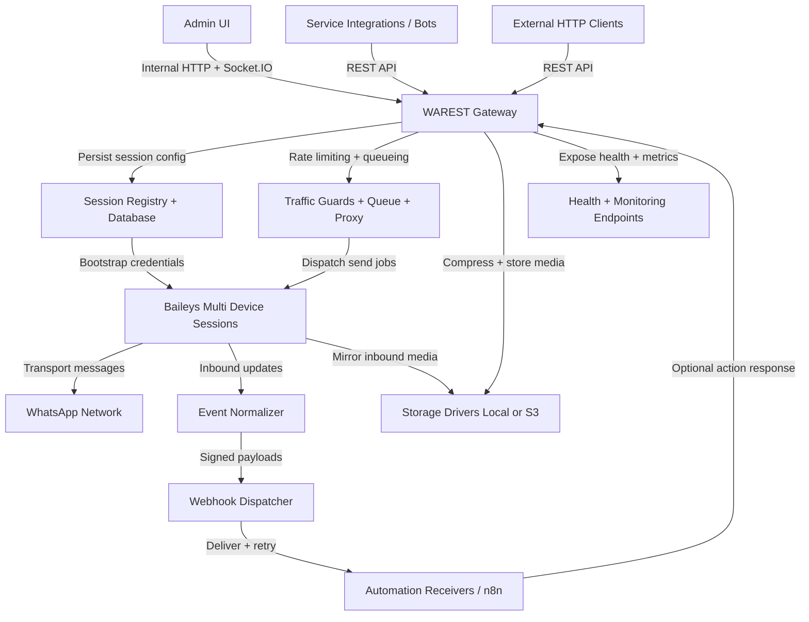

# WAREST Overview

WAREST is an unofficial multi-device, multi-session WhatsApp REST API built with Node.js. It exposes REST endpoints, a guarded admin UI, OpenAPI docs, and webhooks so engineering teams can automate WhatsApp messaging while retaining control over sessions, storage, and operational safeguards such as rate limiting, anti-spam queues, and proxy management.

## What Is WAREST?

WAREST (WhatsApp REST) is a self-hosted gateway that bridges your services with WhatsApp. It runs as an Express + Socket.IO server, manages WhatsApp multi-device sessions via the `@whiskeysockets/baileys` stack, and persists state in SQLite/MySQL/PostgreSQL. The server bundles FFmpeg-based media tooling, local/S3 storage drivers, and automation helpers so you can script messaging flows or integrate with low-code tools (e.g., the n8n community node `@triyatna/n8n-nodes-warest`).

## Key Features

- Multi-session and multi-device support with registry sync and automatic bootstrap/reconnect.
- Complete messaging surface: text, media/files/audio/doc/sticker/GIF, contact, location, poll, interactive buttons/lists, plus reactions, edits, revokes, stars, read receipts, mute/archive/pin actions.
- Group and profile management APIs covering creation, invites, approvals, locks, announcements, avatars, privacy options, and business profile data.
- Webhooks with signed payloads (HMAC SHA-2), retries with jittered backoff, optional media mirroring, and action-in-response execution.
- Storage drivers for encrypted local folders or any S3-compatible service, with signed URLs and configurable TTLs.
- Queueing, rate limiting, anti-spam cooldowns, and proxy pools to keep sessions stable under load.
- Built-in UI for monitoring, session lifecycle, and OpenAPI 1.3.42 documentation protected by login/API key.
- Deployment flexibility: bare metal (npm scripts) or Docker images/compose with environment-driven configuration.

## Architecture

WAREST is organized into several cooperating layers:

- **HTTP Gateway & UI** - Express routes provide the REST API, login-protected docs, and a Socket.IO-powered admin UI (Socket.IO is reserved for internal dashboards, while external systems integrate over REST + webhooks). Helmet + CORS guard the surface, and API keys or admin credentials control access.
- **Session Registry & Database** - Sessions live in a registry persisted via SQLite by default (or MySQL/PostgreSQL). Migrations and admin seeding happen on boot, and registry sync keeps multiple workers coherent.
- **WhatsApp Connectivity Layer** - The Baileys client handles QR/pair-code auth, message transport, and event streams. It emits lifecycle events that feed logs, webhooks, and socket updates.
- **Media & Storage Services** - Media processing leverages sharp + FFmpeg, with pluggable storage drivers (local encrypted paths or S3-compatible bucket). Signed URLs expose public assets when needed.
- **Task Queue & Guards** - Rate limiters, anti-spam cool-downs, and a retry/backoff queue defend upstream services. Proxy pools rotate outbound traffic when required.
- **Webhook Dispatcher** - Delivers signed events with retries/backoff and allows downstream systems to enqueue follow-up actions directly in the webhook JSON response.

## Workflow

1. **Provision & Configure** - Clone the repo or pull the Docker image, copy `.env.example`/`.env.docker`, and define admin credentials, API key, DB/storage drivers, timezone, and webhook defaults.
2. **Install Dependencies** - Install Node.js >= 22 and npm packages, ensure FFmpeg is on PATH (or in the container), and run `npm run db:migrate` (or the Docker entrypoint) so the database schema and seed admin/user data exist.
3. **Start the Service** - Use `npm run dev`, `npm run win-dev`, `npm start`, or `docker compose up -d` to boot the server. Express exposes the API/UI on the configured host/port (default `7308`).
4. **Create Sessions** - Via UI or `/api/v1/session/create` (or pair-code variant), admins link WhatsApp devices, scan QR/pair codes, and persist session keys handled by Baileys.
5. **Send & Receive Messages** - Your services call `/api/v1/messages/*`, `/api/v1/chats`, `/api/v1/groups`, etc., while inbound messages, reactions, and group events trigger webhook deliveries.
6. **Automation & Storage** - Webhook receivers can respond with `"actions"` to send replies, mark read, or trigger other API calls automatically. Media is compressed and stored through the configured driver, exposing signed URLs when necessary.
7. **Monitor & Maintain** - Health endpoints (`/api/v1/server/*`), UI dashboards, and logs track queue usage, proxy health, and webhook success. Sessions can be reconnected, logged out, or deleted through REST/UI.

The diagram below mirrors how WAREST provisions sessions, executes messaging workloads, delivers webhooks, and feeds automation responses back into the platform.

## Prerequisites

- Node.js 22+ with npm (for bare-metal installs) or Docker Engine + Docker Compose if containerized.
- FFmpeg accessible on PATH or mounted into the container for media compression/transcoding.
- Write access to `data/` (DB, sessions, private/public storages) or an external DB + S3-compatible bucket.
- Configured environment variables: admin username/password, admin API key, DB driver/options, storage driver paths/URLs, allowed origins, timezone/locale, webhook defaults, optional proxy list.
- Network access to WhatsApp endpoints and any configured proxies/storage endpoints.

## Common Use Cases

- **Customer support desks** integrating ticketing/CRM systems with WhatsApp, delivering two-way conversations with templated replies, media attachments, and chat state sync.
- **Marketing or notification services** sending scheduled announcements, polls, interactive lists, or media to opted-in contacts via the REST endpoints or queue-driven workers.
- **Automation/orchestration platforms** (e.g., n8n, custom bots) consuming webhooks to trigger workflows, and responding with actions to auto-reply, escalate, or enrich data.
- **Operational dashboards** that require multi-session visibility, ability to reconnect or rotate devices, and fine-grained control over group participation, profile updates, or contact management.

## Limitations & Important Notes

- WAREST is **not** an official Meta/WhatsApp product; APIs may break when WhatsApp updates its protocol, and Baileys upgrades may be required.
- Accounts remain bound by WhatsApp ToS, sender limits, spam heuristics, and region-specific regulations; misuse can lead to throttling or bans.
- Media compression relies on FFmpeg and sharp; missing codecs or misconfigured binaries can limit supported formats.
- Local storage driver encrypts data by default, but you must persist `data/` volumes (or configure S3) to avoid losing sessions/media.
- High-volume sends must respect configured rate limits/queues; exceeding them may drop requests or delay processing.
- Webhooks assume reachable endpoints; repeated failures trigger retries with backoff and may temporarily disable delivery.

## Risks & Disclaimer

- Running WAREST may violate WhatsApp terms if used for unsolicited messaging; deploy only for compliant, opt-in communications.
- Meta can change transport behavior without notice, potentially invalidating sessions or causing downtime-monitor releases closely.
- You are responsible for securing API keys, admin credentials, storage secrets, and webhook endpoints; leaked credentials enable full account takeover.
- Jurisdiction-specific privacy/lawful intercept rules apply when mirroring or storing message content/media-obtain consent and follow data-retention policies.
- Use the software at your own risk; the maintainers provide it under MIT without warranty, and no affiliation with WhatsApp/Facebook/Meta exists.
