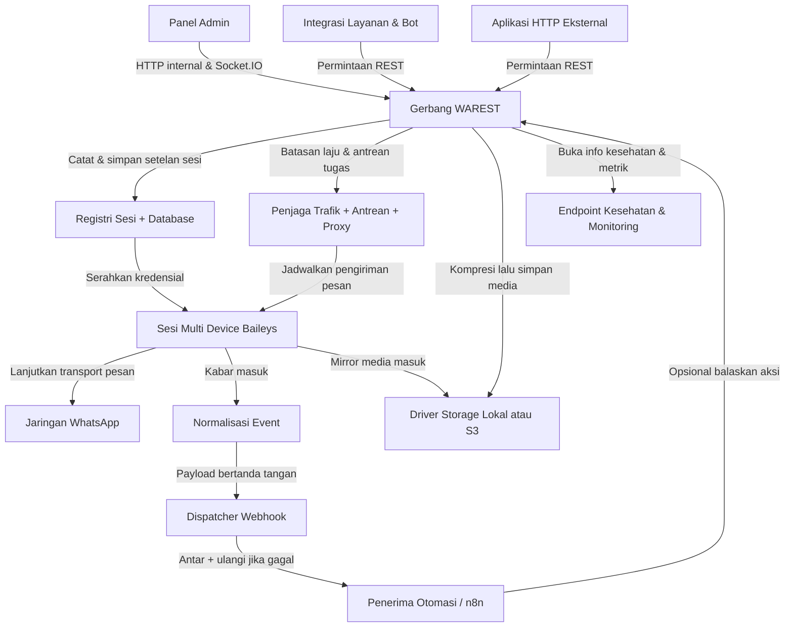

# Ikhtisar WAREST

WAREST adalah WhatsApp REST API multi-perangkat dan multi-sesi tidak resmi yang dibangun dengan Node.js. Platform ini mengekspos endpoint REST, UI admin terlindungi, dokumentasi OpenAPI, serta webhook sehingga tim engineering dapat mengotomasi pesan WhatsApp sambil menjaga kendali atas sesi, penyimpanan, dan pengaman operasional seperti rate limiting, antrean anti-spam, dan manajemen proxy.

## Apa Itu WAREST?

WAREST (WhatsApp REST) merupakan gateway self-hosted yang menjembatani layanan Anda dengan WhatsApp. Ia berjalan sebagai server Express + Socket.IO, mengelola sesi multi-device WhatsApp melalui stack `@whiskeysockets/baileys`, dan menyimpan state di SQLite/MySQL/PostgreSQL. Server ini membundel tool media berbasis FFmpeg, driver storage lokal/S3, serta helper otomasi sehingga Anda bisa membuat alur pesan atau mengintegrasikannya dengan alat low-code (misalnya node komunitas n8n `@triyatna/n8n-nodes-warest`).

## Fitur Utama

- Dukungan multi-sesi dan multi-device dengan sinkronisasi registri serta bootstrap/reconnect otomatis.
- Permukaan pesan lengkap: teks, media/file/audio/dokumen/stiker/GIF, kontak, lokasi, polling, tombol/daftar interaktif, juga reaksi, edit, revoke, bintang, tanda baca, pengarsipan, mute, dan pin.
- API manajemen grup serta profil mencakup pembuatan, undangan, persetujuan, kunci, pengumuman, avatar, opsi privasi, dan data profil bisnis.
- Webhook dengan payload bertanda tangan (HMAC SHA-2), retry dengan backoff plus jitter, opsi mirroring media, dan eksekusi aksi dalam respons.
- Driver storage untuk folder lokal terenkripsi atau layanan kompatibel S3 dengan signed URL dan TTL yang dapat disetel.
- Antrean, rate limiting, cooldown anti-spam, dan pool proxy untuk menjaga sesi tetap stabil saat beban tinggi.
- UI bawaan untuk monitoring, siklus hidup sesi, dan dokumentasi OpenAPI 1.3.42 yang terlindungi login/API key.
- Fleksibilitas deployment: bare metal (npm scripts) atau image/container Docker dengan konfigurasi berbasis environment.

## Arsitektur

WAREST tersusun dalam beberapa lapisan yang saling bekerja sama:

- **HTTP Gateway & UI** -- Route Express menyediakan REST API, dokumentasi login-protected, dan UI admin berbasis Socket.IO (Socket.IO disediakan untuk dasbor internal, sedangkan sistem eksternal berintegrasi melalui REST + webhook). Helmet + CORS menjaga permukaan, dan akses dikontrol oleh API key atau kredensial admin.
- **Registri Sesi & Database** -- Sesi disimpan di registri yang dipersistenkan via SQLite secara default (atau MySQL/PostgreSQL). Migrasi dan seeding admin dijalankan saat boot, dan sinkronisasi registri menjaga konsistensi antar worker.
- **Lapisan Konektivitas WhatsApp** -- Klien Baileys menangani autentikasi QR/pair-code, transport pesan, dan stream event. Klien ini memancarkan event lifecycle yang mengisi log, webhook, dan pembaruan socket.
- **Layanan Media & Storage** -- Pemrosesan media memanfaatkan sharp + FFmpeg dengan driver storage pluggable (lokal terenkripsi atau bucket kompatibel S3). Signed URL tersedia saat aset perlu diekspos publik.
- **Antrean Tugas & Guardrail** -- Rate limiter, cooldown anti-spam, dan antrean retry/backoff melindungi layanan upstream. Pool proxy merotasi trafik keluar saat dibutuhkan.
- **Dispatcher Webhook** -- Mengirim event bertanda tangan dengan retry/backoff dan memungkinkan sistem downstream mengantrikan aksi lanjutan langsung di JSON respons webhook.

## Alur Kerja

1. **Provision & Konfigurasi** -- Clone repo atau tarik image Docker, salin `.env.example`/`.env.docker`, lalu isi kredensial admin, API key, driver DB/storage, zona waktu, dan default webhook.
2. **Pasang Dependensi** -- Instal Node.js >= 22 beserta paket npm, pastikan FFmpeg ada di PATH (atau di dalam container), lalu jalankan `npm run db:migrate` (atau entrypoint Docker) agar skema database serta data admin awal tersedia.
3. **Mulai Layanan** -- Pakai `npm run dev`, `npm run win-dev`, `npm start`, atau `docker compose up -d` untuk menyalakan server. Express mengekspos API/UI pada host/port terkonfigurasi (default `7308`).
4. **Buat Sesi** -- Lewat UI atau `/api/v1/session/create` (atau varian pair-code), admin menghubungkan perangkat WhatsApp, memindai QR/pair code, dan menyimpan key sesi yang diurus Baileys.
5. **Kirim & Terima Pesan** -- Layanan Anda memanggil `/api/v1/messages/*`, `/api/v1/chats`, `/api/v1/groups`, dsb., sementara pesan masuk, reaksi, dan event grup memicu pengiriman webhook.
6. **Otomasi & Storage** -- Penerima webhook dapat merespons dengan `"actions"` untuk mengirim balasan, menandai baca, atau memicu panggilan API lain secara otomatis. Media dikompresi dan disimpan lewat driver terkonfigurasi, serta ekspos signed URL bila diperlukan.
7. **Monitor & Rawat** -- Endpoint kesehatan (`/api/v1/server/*`), dasbor UI, dan log memantau penggunaan antrean, kesehatan proxy, serta keberhasilan webhook. Sesi bisa disambung ulang, logout, atau dihapus melalui REST/UI.

Diagram berikut menggambarkan bagaimana WAREST melakukan provisioning sesi, mengeksekusi beban kerja pesan, mengirim webhook, dan memanfaatkan respons otomasi.

## Prasyarat

- Node.js 22+ dengan npm (untuk instalasi bare metal) atau Docker Engine + Docker Compose bila menjalankan dalam container.
- FFmpeg tersedia di PATH atau dimount ke dalam container untuk kebutuhan kompresi/transcoding media.
- Akses tulis ke `data/` (DB, sesi, storage privat/publik) atau DB eksternal + bucket kompatibel S3.
- Variabel environment terkonfigurasi: username/password admin, API key admin, driver DB, jalur/URL storage, allowed origins, zona waktu/locale, default webhook, serta daftar proxy opsional.
- Akses jaringan ke endpoint WhatsApp dan endpoint proxy/storage yang digunakan.

## Use Case Umum

- **Customer support desk** yang menghubungkan sistem tiket/CRM ke WhatsApp untuk percakapan dua arah dengan template, lampiran media, dan sinkronisasi state chat.
- **Layanan marketing atau notifikasi** yang mengirim pengumuman terjadwal, polling, daftar interaktif, atau media kepada kontak opt-in melalui endpoint REST atau worker antrean.
- **Platform otomasi/orchestrator** (misal n8n, bot kustom) yang mengonsumsi webhook untuk memicu workflow dan merespons dengan aksi untuk auto-reply, eskalasi, atau enriching data.
- **Dasbor operasional** yang membutuhkan visibilitas multi-sesi, kemampuan sambung ulang atau rotasi perangkat, serta kontrol rinci atas partisipasi grup, pembaruan profil, atau manajemen kontak.

## Limitasi & Catatan Penting

- WAREST **bukan** produk resmi Meta/WhatsApp; API dapat berubah saat WhatsApp memperbarui protokolnya dan upgrade Baileys mungkin dibutuhkan.
- Akun tetap terikat dengan ToS WhatsApp, batas pengirim, heuristik spam, dan regulasi regional; penyalahgunaan bisa memicu throttling atau ban.
- Kompresi media bergantung pada FFmpeg dan sharp; codec yang hilang atau binary yang tidak benar membatasi format yang didukung.
- Driver storage lokal mengenkripsi data secara default, tetapi Anda harus mem-persist volume `data/` (atau memakai S3) untuk menghindari kehilangan sesi/media.
- Pengiriman volume besar harus mematuhi rate limit/antrean yang dikonfigurasi; melewati batas bisa menjatuhkan request atau menunda pemrosesan.
- Webhook mengasumsikan endpoint dapat dijangkau; kegagalan berulang memicu retry dengan backoff dan dapat menonaktifkan pengiriman sementara.

## Risiko & Disclaimer

- Menjalankan WAREST dapat melanggar ketentuan WhatsApp jika dipakai untuk pesan tidak sah; gunakan hanya untuk komunikasi yang patuh dan berbasis izin.
- Meta bisa mengubah perilaku transport tanpa pemberitahuan, yang berpotensi membuat sesi invalid atau menyebabkan downtime -- pantau rilis secara rutin.
- Anda bertanggung jawab mengamankan API key, kredensial admin, secret storage, dan endpoint webhook; kredensial yang bocor memungkinkan pengambilalihan penuh.
- Aturan privasi atau lawful intercept di setiap yurisdiksi berlaku saat melakukan mirroring atau menyimpan konten/media pesan -- pastikan ada persetujuan dan patuhi kebijakan retensi data.
- Gunakan perangkat lunak ini dengan risiko sendiri; maintainer hanya menyediakan di bawah lisensi MIT tanpa jaminan dan tidak memiliki afiliasi dengan WhatsApp/Facebook/Meta.
